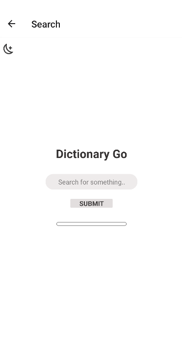
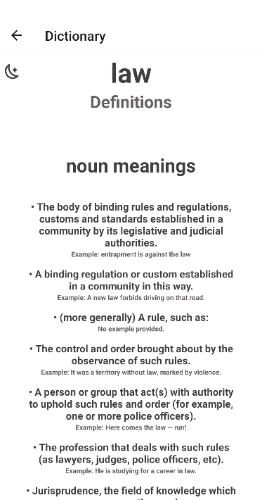

# Dictionary GO
Dictionary GO is a cross-platform dictionary application. It features a light and dark mode, 
a modern and responsive interface, as well as detailed explainations of search queries, providing 
examples as well.

## Screenshots / GIFs

